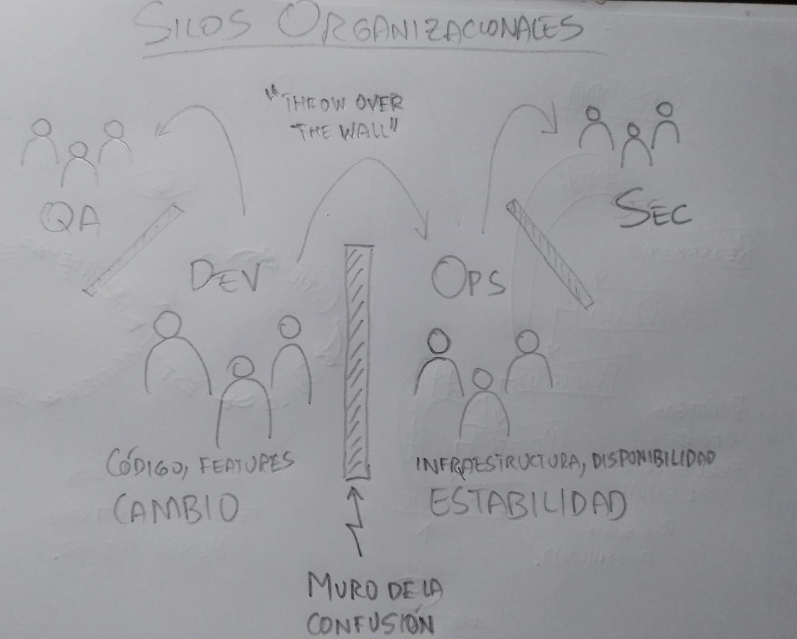

# Actividad 1: introducción devops, devsecops

**Estudiante: Aldo Luna Bueno**
**Entorno usado: Windows 10**

## Día 1

### 4.1 DevOps vs. Cascada

En la cascada tradicional una fase (requerimientos, diseño, desarrollo, pruebas, despliegue) no comienza si no termina la anterior. Este flujo de trabajo rígido reduce la flexibilidad. Esto significa que cualquier cambio tardío nos hace retroceder una o varias fases atrás y es costoso. Además, el feedback solo se obtiene al terminar todas las fases, por lo que los problemas son descubiertos tarde. Además, algo intrinseco a este flujo de trabajo es que el tamaño de entregas es grande, lo cual aumenta el riesgo de errores. Por último, los despliegues y pruebas son casi siempre manuales, lo cual introduce el riesgo de errores humanos y además ralentiza el proceso.

DevOps, al contrario que la cascada tradicional, presenta un flujo de trabajo en ciclos cortos. Integra desarrollo, pruebas y operaciones de manera continua, aunque esto requiere mayor coordinación y experiencia en herramientas para evitar el caos. DevOps tiene un feedback constante gracias a la automatización en test, monitoreo e integración continua. Las métricas DORA muestran que equipos con CI/CD reducen en 3-4 veces el tiempo de recuperación frente a fallas. Además, el tamaño de entregas es por lotes pequeños (features individuales, sprints cortos, etc.), por tanto la superficie de riesgo es menor y si algo falla se podrá identificar rápidamente qué cambio causó la falla. La automatización de CI/CD conlleva una inversión inicial en tiempo para desarrollar pipelines, pero luego se produce una aceleración, ya que por ejemplo los tiempos de despliegue pasan de semanas a horas o incluso minutos.

**Pregunta retadora.** Señala un contexto real donde un enfoque cercano a cascada sigue siendo razonable.

Un ejemplo puede ser el desarrollo de un sistema crítico de aeronáutica. Cada fase del ciclo de vida debe quedar documentada, auditada y trazable para cumplir la conformidad regultoria, en este caso, con la certeificaión DO-178C, por ejemplo. Esto calza perfectamente con el enfoque de cascada tradicional. La documentación es exhaustiva, ya que las auditorías y certificaciones dependen de que la evidencia documental sea completa y secuencial. Y aunque esto ralentiza los cambios y sacrifica la velocidad, asegura la conformidad y seguridad.

A esto le podemos sumar que el sistema a desarrollar depende fuertemente de un hardware costoso y limitado. En DevOps iteramos muchas veces nuestro software para buscar la mejora continua, pero el desarrollo del hardware no le puede seguir el paso porque es más lento y más costoso de iterar. Así el software se debe planificar con mucha anticipación, y esto impide experimentar con ciclos cortos, pero reduce fallas catastróficas.

### 4.2 Silos y antipatrones

En el ciclo tradicional de dos pasos, al no hacer integraciones continuas, el código y los cambios de los equipos de desarrollo se acumulan durante mucho tiempo antes de entregar a operaciones, y terminamos con grandes lotes de entrega. A estas entregas se les llama big bang releases. Esto dificulta que los errores se puedan aislar, y si hay algún problema aplicar un rollback deshace el lote completo. Las métricas DORA dicen que equipos con grandes lotes de entrega tienen menor frecuencia de despliegue y mayor MTTR (tiempo promedio de recuperación).

Otro antipatrón son las colas de defectos. QA y operaciones reciben el producto terminado al final de la fase de construcción, pero el software siempre va a llegar con defectos, y estos se acumulan en una cola de validación. Este antipatrón lleva también el nombre de "Defect backlog", y es un montón de errores sin priorizar, muchos de ellos obsoletos o irrelevantes. Y el problema es que corregirlos cuesta mucho más tiempo y dinero, así que el equipo de operaciones solo le queda heredar los errores y parcharlos como pueda ("throw over the wall"), a costa de la calidad.

### 4.3 Principios y beneficios

#### CI y CD (Continuous Integration / Continuous Delivery)

CI/CD, también llamado desarrollo continuo, reduce la fricción entre dev y ops, ya que convierte la integración y despliegue en un proceso repetible y compartido.

En CI procuramos integrar los cambios de código en main frecuentemente y en pequeños lotes para evitar la acumulación de cambios grandes y riesgosos. También se ejecutan pruebas automatizadas cercanas al código (unitarias, de seguridad) para detectar defectos rápidamente. Esto requiere una colaboración temprana entre desarrolladores y también con QA/SRE para crear pruebas y establecer estándares de calidad.

CD extiende CI al flujo de despliegue. Cada cambio aprobado es empaquetado (ej. Docker) y listo para ser desplegado en producción con un clic o automáticamente. En CD automatizamos el despliegue (ej. AWS CLI), la configuración (ej. Ansible) y la infraestructura (ej. Terraform). Así un mismo cambio fluye por todos entornos sin fricción: desarrollo, QA, staging y producción. Todo esto requiere que dev y ops colaboren en la definición de pipelines, pruebas de integración, monitoreo y mecanismos de rollback en caso de problemas en producción.

#### Agile como precursor: feedback en el pipeline

Un ejemplo de práctica Agile que alimente decisiones del pipeline podría ser el daily stand-up o reuniones diarias, en donde los problemas discutidos (ej. un bug recurrente) pueden alimentar el pipeline. Ahí pueden acordar bloquear despliegues si la cobertura de tests cae por debajo de cierto porcentaje o si falla una prueba crítica. De esta forma Agile proporciona un mecanismo social que guía las decisiones técnicas del pipeline.

#### Indicador observable (no financiero)

Un indicador muy importante en DevOps es el llamado "Lead Time to Changes" (métrica DORA), que mide el tiempo desde que un cambio es commiteado hasta que llega a producción. Pero aquí nos interesamos por una submétrica que podríamos llamar "PR done to Staging", que es el tiempo desde que un Pull Request (PR) está listo hasta que se despliega en entorno de pruebas (staging). Es un indicador útil porque mide la fricción entre dev y ops. Por ejemplo, interpretamos que si este tiempo baja hay mejor automatización, coordinación y confianza. Por el contrario, si el tiempo sube hay cuellos de botella, como revisiones lentas, conflictos entre equipos, pipelines inestables. Hay herramientas como Datalog o Axify respaldan subdivisiones como esta para usarlas como métricas.
