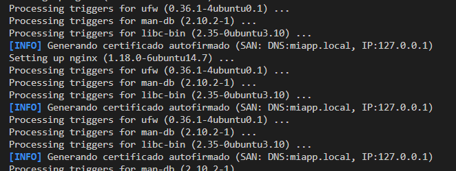
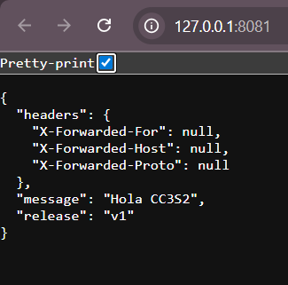

# Reporte del avance de la Actividad 2

Partimos del [script Bash de respuesta.](./Respuestas-actividad2.sh)

Aquí se puede ver la respuesta en formato JSON del app de Flask que está corriendo y escuchando en el puerto 8081 (se cambió el puerto porque ya se estaba usando el 8080).

